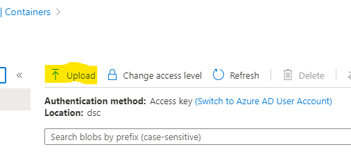
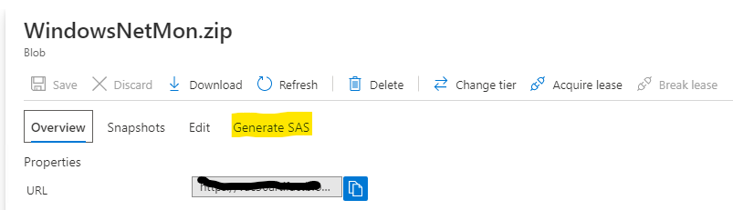
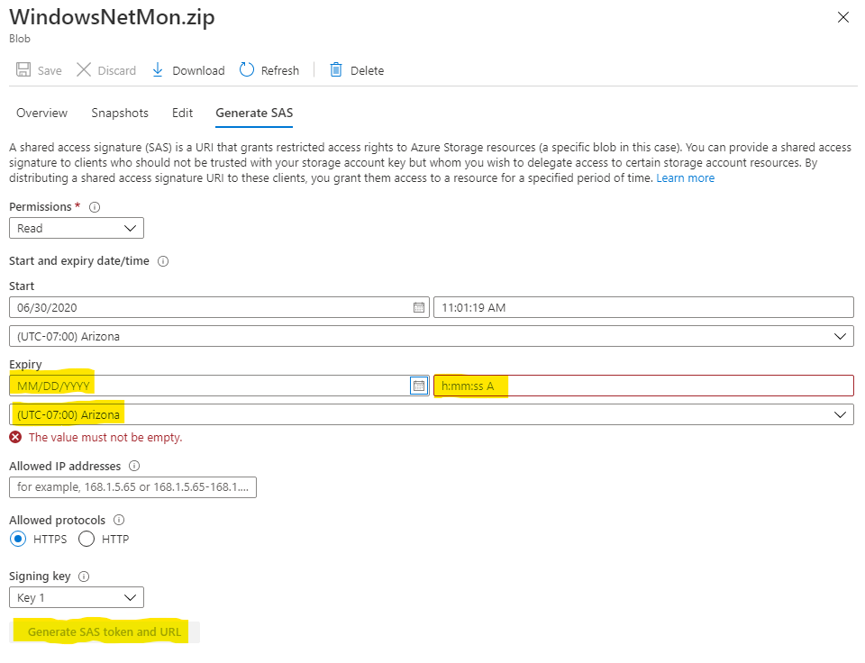
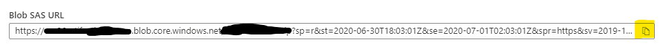

# Microsoft Network Monitor for Azure Virtual Machines

## Overview

Deploying the 'in-guest' application, Microsoft Network Monitor, is not top of mind when deploying virtual machines into Azure.  However, there are many situation, especially for support cases where having Microsoft Network Monitor installed is imperative to the troubleshooting process.  This repository will provide all the necessary components to install (deploy) and remotely configure Microsoft Network Monitor 3.4 for any number of virtual machines running in Azure.

## Prerequisites

- Contributor RBAC rights to the Resource Group or Subscription in Azure
- Administrative rights on the target virtual machines
- PowerShell Modules Installed
  - Az
  - xPSDesiredStateConfiguration
- Ability to open PowerShell as Administrator
- Azure Storage Account (DSC Archive)
- SMB File share (XML and EXE storage) *Optional*

## Install / Deploy the application

1. Review the WindowsNetMon.ps1 Desired State Configuration (DSC) script and update the *SourcePath* with the path where the Microsoft Network Monitor 3.4 executable is located

    > Note: Be sure to download Microsoft Network Monitor 3.4 from [here](https://www.microsoft.com/en-us/download/details.aspx?id=4865)

    ````PowerShell
    File DownloadPackage
    {
        Ensure = "Present"
        SourcePath = "\\###SOURCE-PATH###\NM34_x64.exe"
        DestinationPath = "C:\Temp\packages\NM34_x64.exe"
        Type = "File"
        Force = $true
        DependsOn = "[File]CreatePackageDirectory"
    }
    ````

2. Create the DSC Archive zip file

    ````PowerShell
    Publish-AzVMDscConfiguration .\WindowsNetMon.ps1 -OutputArchivePath .\WindowsNetMon.zip -Force
    ````

3. Upload the DSC archive zip file to an Azure storage account and create a Shared Access Signature (SAS) uri.

    > Note: If not created, create a storage account and a subsequent container.

    - Navigate to the storage account and container, then click 'Upload'

        

    - After the upload, select the file and then select 'Generate SAS'

        

    - Provide an expiration date for the SAS key, then click 'Generate SAS token and URL'

        

    - Once generated, click the 'copy' icon to copy the URL (save it for your records)

        

4. Open PowerShell as Administrator and navigate to the directory where this repository was cloned or extracted